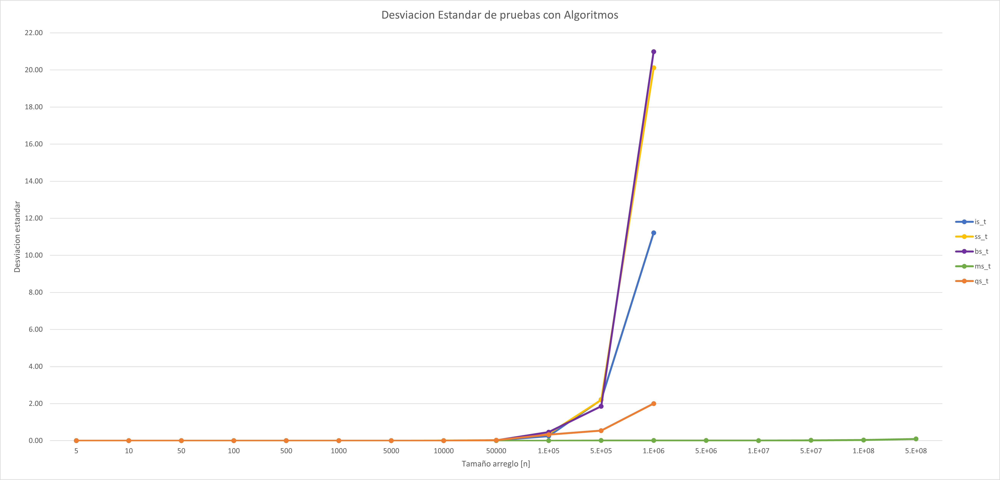

# Práctica 4: Algoritmos de ordenamiento
## Resumen de Resultados
### Promedio del tiempo de ejecucion por algotimos
| Array size   | is_t   | ss_t   | bs_t   | ms_t   | qs_t   |   
| ------------ |:------:|:------:|:------:|:------:|:------:|
| 5	  | 1.22E-07 | 1.64E-07	| 8.52E-08	| 2.88E-07	| 2.00E-07 |
| 10  |	2.49E-07 | 4.39E-07	| 1.65E-07	| 6.31E-07	| 5.36E-07 |
| 50  | 2.31E-06 | 5.11E-06	| 2.98E-06	| 3.60E-06	| 7.83E-06 |
| 100 | 7.72E-06 |1.45E-05	| 9.38E-06	| 7.03E-06	| 2.86E-05 |
| 500 | 0.00012	| 0.0002 | 0.00019 | 0.00003 | 0.00058 |
| 103 | 0.00046	| 0.00074	| 0.00075	| 0.00006	| 0.00228 |
| 5x103 |	0.01061 | 0.0178	| 0.01878	| 0.00037	| 0.05704 |
| 104 |	0.04334 |	0.07207 |	0.07508 |	0.00079 |	0.22695 |
| 5x104 |	1.07804	| 1.73735 | 1.88511	| 0.00443	| 5.66504 |
| 105 | 5.30489 | 8.42962 | 8.88149 | 0.01518 | 9.82757 |
| 5x105 | 93.00213 | 145.5503| 148.5243 | 0.06317 | 30.51924 |
| 106 | 352.91142 | 552.56605 | 561.34463 | 0.12305 | 57.79891 |
| 5x106 | x | x | x | 1.0538 | x | 
| 107 | x | x | x | 2.18499 | x | 
| 5x107 | x | x | x | 11.8816 | x | 
| 108 | x | x | x | 24.6073 | x | 
| 5x108 | x | x | x | 132.951 | x | 
| 109 | x | x | x | x| x | 

### Desviacion estandar de ejecuciones por algoritmo
| Array size   | is_t   | ss_t   | bs_t   | ms_t   | qs_t   |   
| ------------ |:------:|:------:|:------:|:------:|:------:|
| 5	  | 2.28E-08 | 2.76E-08	 | 1.83E-08	| 4.93E-08	| 4.68E-08 |
| 10  |	3.24E-08 | 5.29E-08	| 3.60E-08	| 1.01E-07	| 4.87E-08 |
| 50  | 2.48E-07 | 2.12E-07 | 1.74E-07 | 2.93E-07 | 9.41E-07 |
| 100 | 6.54E-07 | 1.88E-06 | 1.61E-06 | 1.23E-06 | 2.52E-06 |
| 500 | 0	| 0 | 0.00001 | 0 | 0.00001 |
| 103 | 0.00008	| 0.00002	| 0.00001	| 0	| 0.00009 |
| 5x103  | 0.00025 | 0.00112 | 0.0005 | 0.00003| 0.00088 |
| 104 |	0.00206 |	0.00467 |	0.00206 |	0.00008 |	0.00235 |
| 5x104 |	0.01699	| 0.02776 | 0.01976	| 0.00031 | 0.0265 |
| 105 | 0.25065 | 0.36689 | 0.4616 | 0.00274 | 0,32341 |
| 5x105 | 2.21464 | 2.20282 | 1.85994 | 0.01176 | 0.54196 |
| 106 | 11.21384 | 20.11702 | 20.99095 | 0.00932 | 2.00145 |
| 5x106 | x | x | x | 0.01018 | x | 
| 107 | x | x | x | 0.00645 | x | 
| 5x107 | x | x | x | 0.02013 | x | 
| 108 | x | x | x | 0.03419 | x | 
| 5x108 | x | x | x | 0.09441 | x | 
| 109 | x | x | x | x| x | 

## Graficas del resumen de los resultados

- Las graficas fueron realizadas con el promedio de los datos obtenidos. 

- Se hicieron 3 grafias separadas con el motivo de poder dimensionar la tendencia de los algoritmos en distintos rangos de prueba

- Para las desviaciones estandar se decidio hacer otra grafica de lineas, ya que es interesante ver la diversidad de datos que se obtienen en ciertos tamaños y la consistencia que puedan tener los algoritmos

## Analisis de resultados

### Sobre la consistencia de los algortmos

- Es interesante ver la consistencia casi absoulta de todos los algoritmos cuando son sometidos a pruebas de hasta 50 mil. Por lo que estos algoritmos son predecibles hasta este rango.

- Tambien es importante notar el aumento exponencial de la dispersion de dos algoritmos _selectionsort y bubblesort_ este salto destaca porque de tener una desviacion aproximada a dos con _n igual a 500 mil_ a pasar a una desviacion de 20 con _n igual a un millon_ haciendo mencion tambien al aumento de la desviacion para _insertionsort_ que llego a pasar 10. Y casualmente esta variabilidad afecta o esta relacionada con el rendimiento de estos algoritmos ya que en este rango de _n igual a un millon_ es cuando se disparan los tiempos promedio y en las pruebas se ven los primeros tiempos promedios rondando un tiempo de 100 segundos por ejecucion.

- Haciendo mencion de _mergesort_ es increible la consistencia que tiene incluso con arreglos enormes, y es que toda la dispersion se mantiene  muy cerca de cero y con el arreglo mas grande registrado la desviacion se encuentra dentro de las centecimas!