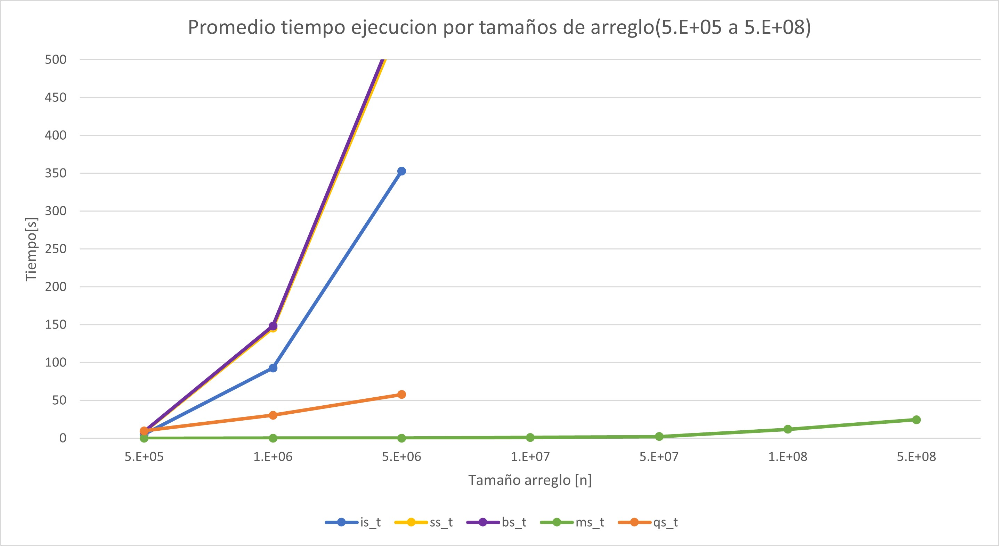

# Práctica 4: Algoritmos de ordenamiento
## Resumen de Resultados
### Promedio del tiempo de ejecucion por algotimos
| Array size   | is_t   | ss_t   | bs_t   | ms_t   | qs_t   |   
| ------------ |:------:|:------:|:------:|:------:|:------:|
| 5	  | 1.22E-07 | 1.64E-07	| 8.52E-08	| 2.88E-07	| 2.00E-07 |
| 10  |	2.49E-07 | 4.39E-07	| 1.65E-07	| 6.31E-07	| 5.36E-07 |
| 50  | 2.31E-06 | 5.11E-06	| 2.98E-06	| 3.60E-06	| 7.83E-06 |
| 100 | 7.72E-06 |1.45E-05	| 9.38E-06	| 7.03E-06	| 2.86E-05 |
| 500 | 0.00012	| 0.0002 | 0.00019 | 0.00003 | 0.00058 |
| 103 | 0.00046	| 0.00074	| 0.00075	| 0.00006	| 0.00228 |
| 5x103 |	0.01061 | 0.0178	| 0.01878	| 0.00037	| 0.05704 |
| 104 |	0.04334 |	0.07207 |	0.07508 |	0.00079 |	0.22695 |
| 5x104 |	1.07804	| 1.73735 | 1.88511	| 0.00443	| 5.66504 |
| 105 | 5.30489 | 8.42962 | 8.88149 | 0.01518 | 9.82757 |
| 5x105 | 93.00213 | 145.5503| 148.5243 | 0.06317 | 30.51924 |
| 106 | 352.91142 | 552.56605 | 561.34463 | 0.12305 | 57.79891 |
| 5x106 | x | x | x | 1.0538 | x | 
| 107 | x | x | x | 2.18499 | x | 
| 5x107 | x | x | x | 11.8816 | x | 
| 108 | x | x | x | 24.6073 | x | 
| 5x108 | x | x | x | 132.951 | x | 
| 109 | x | x | x | x| x | 

### Desviacion estandar de ejecuciones por algoritmo
| Array size   | is_t   | ss_t   | bs_t   | ms_t   | qs_t   |   
| ------------ |:------:|:------:|:------:|:------:|:------:|
| 5	  | 2.28E-08 | 2.76E-08	 | 1.83E-08	| 4.93E-08	| 4.68E-08 |
| 10  |	3.24E-08 | 5.29E-08	| 3.60E-08	| 1.01E-07	| 4.87E-08 |
| 50  | 2.48E-07 | 2.12E-07 | 1.74E-07 | 2.93E-07 | 9.41E-07 |
| 100 | 6.54E-07 | 1.88E-06 | 1.61E-06 | 1.23E-06 | 2.52E-06 |
| 500 | 0	| 0 | 0.00001 | 0 | 0.00001 |
| 103 | 0.00008	| 0.00002	| 0.00001	| 0	| 0.00009 |
| 5x103  | 0.00025 | 0.00112 | 0.0005 | 0.00003| 0.00088 |
| 104 |	0.00206 |	0.00467 |	0.00206 |	0.00008 |	0.00235 |
| 5x104 |	0.01699	| 0.02776 | 0.01976	| 0.00031 | 0.0265 |
| 105 | 0.25065 | 0.36689 | 0.4616 | 0.00274 | 0,32341 |
| 5x105 | 2.21464 | 2.20282 | 1.85994 | 0.01176 | 0.54196 |
| 106 | 11.21384 | 20.11702 | 20.99095 | 0.00932 | 2.00145 |
| 5x106 | x | x | x | 0.01018 | x | 
| 107 | x | x | x | 0.00645 | x | 
| 5x107 | x | x | x | 0.02013 | x | 
| 108 | x | x | x | 0.03419 | x | 
| 5x108 | x | x | x | 0.09441 | x | 
| 109 | x | x | x | x| x | 

## Graficas del resumen de los resultados

- Las graficas fueron realizadas con el promedio de los datos obtenidos. 

- Se hicieron 3 grafias separadas con el motivo de poder dimensionar la tendencia de los algoritmos en distintos rangos de prueba

> El tiempos de los promedios son en segundos

- Para las desviaciones estandar se decidio hacer otra grafica de lineas, ya que es interesante ver la diversidad de datos que se obtienen en ciertos tamaños y la consistencia que puedan tener los algoritmos

## Analisis de resultados

### Sobre la consistencia de los algortmos

- Es interesante ver la consistencia casi absoulta de todos los algoritmos cuando son sometidos a pruebas de hasta 50 mil. Por lo que estos algoritmos son predecibles hasta este rango.

- Tambien es importante notar el aumento exponencial de la dispersion de dos algoritmos _selectionsort y bubblesort_ este salto destaca porque de tener una desviacion aproximada a dos con _n igual a 500 mil_ a pasar a una desviacion de 20 con _n igual a un millon_ haciendo mencion tambien al aumento de la desviacion para _insertionsort_ que llego a pasar 10. Y casualmente esta variabilidad afecta o esta relacionada con el rendimiento de estos algoritmos ya que en este rango de _n igual a un millon_ es cuando se disparan los tiempos promedio y en las pruebas se ven los primeros tiempos promedios rondando un tiempo de 100 segundos por ejecucion.

- Haciendo mencion de _mergesort_ es increible la consistencia que tiene incluso con arreglos enormes, y es que toda la dispersion se mantiene muy cerca de cero y con el arreglo mas grande registrado la desviacion se encuentra dentro de las centecimas! De los algoritmos probados, este es el que por excelencia es predecible.

- _quicksort_ mantiene una desviacion estandar bastante baja durante la mayoria de pruebas, no es hasta el arreglo de orden 105 cuando se nota una cambio sustentable en la desviacion por lo que da un indicativo de que en arreglos grandes tendera a comportarse como los algoritmos iterativos.

### Sobre el tiempo promedio de ejeucion de los algoritmos.

- En general revisando la informacion de toda la tabla de promedios es facil notar que para arreglos enormes los algoritmos iterativos pierden mucho rendimiento mientras que los recursivos, en  especial el _mergesort_, pareciera que no se ve afectado su rendimiento ante tales tamaños.

- Para arreglos de tamaño 105 se pueden notar varias tendencias:
    - _Quicksort_ tiende a ser el que mas se tarda de los cinco
    - Entre los algoritmos iterativos insertion sort es el que obtiene promedios bajos incluso contra _mergesort_ (en un tamaño pequeño de _n = 50_) recordando que fue el mas consistente de todos los 5
    - _mergesort_ destaca en todos los tamaños de arreglo por su increible desempeño mientras algunos algoritmos llegan a tener promedios cerca de 100 seg, _mergesort_ se mantiene en el rango de milesimas de segundo!

- Con los algoritmos iterativos fue dificil hacer pruebas en tamaños grandes ya que el tamaño promedio pasaba facil de ser en minutos a horas y de seguir asi incluso dias y semanas enteras en completar las pruebas

- Para los algoritmos recursivos hablando de merge sort no fue trabajo pesado las pruebas si no hasta 500 millones donde se hizo una hora para completar las pruebas, _quick sort_ apesar de tener mejor desempeño que los iterativos no tuvo el mismo desempeño que _merge sort_ y es que de acuerdo con la grafica la tendencia de tiempo de ejecucion se iba a lo alto con arreglos grandes.

### Tiempo promedio de ejecucion vs Desviacion estandar

- Como se sabe la desviacion estandar es un numero muy util para entender la diversidad de tiempo de ejecuciones de los algoritmos ante distintos tamaños de arreglo.

- A gran escala, una desviacion estandar muy cercana a cero indicaria la consistencia de los algoritmos lo cual se traduce en la efectividad del mismo y lo predecible que pueden ser

- Los algoritmos iterativos, seguido de quick sort, muestran a lo largo de las pruebas que mientras menos efectivos son con arreglos grandes la varianza de sus resultados difieren mucho entre si, lo cual no los convertiria en fiables para pruebas grandes

- Mergesort por el otro lado demuestra que a tiempos promedio muy bajos, signo de su alta eficacia, su desviacion se mantiene en cero y por lo tanto lo vuelve en un algoritmo muy fiable debido a lo consistente que es y su eficiencia

### Consideraciones para toma de muestras

- Como los algoritmos iterativos iban a la alta con sus tiempos por prueba, se decidio no tomarlos en cuenta para pruebas mayores debido a que tomaria inlcuso semanas acabar con alguna de ellas

- El mismo caso para quicksort, demostro que su tendencia apesar de no ser desastroso como los iterativos, igual se comportaba como ellos, la eficiencia bajaba y terminaba siendo menos confiable

- El unico motivo por el cual no se pudo hacer la prueba con mil millones fue por el sistema operativo debido a un problema con la memoria virtual que impedia la ejecucion de la prueba con merge sort

## Conclusiones

- Los algoritmos iterativos se estudio que son de n2 y no fue hasta intentar hacer la prueba con un millon que se corroboro lo que significa ser de ese orden, y dentro de ellos insertion sort resulto mostrar bastante mejores resultados para arreglos diminutos (50 o menos) lo cual lo hace un buen candidato para problemas muy diminutos.

- Dentro de los algoritmos recursivos el que destaca en todo es merge sort, es confiable y eficaz en todo aspecto, mientras que quicksort apesar de tener resultados mejores que los iterativos, igual toma la misma tendencia de ellos lo cual termina por coronar a mergesort como el mejor en todo.